<div align="center">

<a href="assets/readme/teaser.mp4"></a>

<sub>▶ <a href="assets/readme/teaser.mp4"><b>Watch the full 70-second teaser with music (MP4)</b></a></sub>

# VEye · وی‌آی

### The Persian controlled-document & organisation management system

**Write ISO documents with a live print preview, sign them off along your org chart, print them with a QR code anyone can verify —
and run projects, quality, leave and announcements in the same place.**


<br>

-38bdf8)


[Features](#-features) · [Screens](#-a-tour-in-gifs) · [Quick start](#-quick-start) · [Deployment](#-deploying-to-a-server) · [Architecture](#-architecture) · [License](#-license) · [فارسی](#-معرفی-به-فارسی)

</div>

---

## Why VEye?

Most organisations that run an ISO 9001 quality system still keep it in folders of Word files, e-mailed PDFs and wet
signatures. Nobody is sure which revision is current, who approved it, or whether the copy on the wall is still valid.

**VEye replaces that with one web application, in Persian, that your organisation hosts itself:**

| Before | With VEye |
|---|---|
| Word templates copied from desk to desk | One designer for procedures, instructions, posters and forms — with a **live, exact print preview** |
| Signatures chased on paper | **Digital sign-off** — writer → confirmer → managing director, decided by the **org chart** |
| "Is this the latest version?" | Every printed page carries a **QR code**; scanning it says **valid** or **obsolete** *right now* |
| Old revisions still in circulation | A new revision automatically marks the old one **منسوخ (obsolete)** and watermarks it |
| Projects and corrective actions in spreadsheets | Projects, objectives, **non-conformances, CAPA, internal audits and a risk register** with reminders |
| Requests over chat apps | A built-in **کارتابل** (inbox & chat), **leave requests** and **company announcements** |

Everything is Persian and right-to-left, every date is Jalali (شمسی), and all data — database, uploaded files, signatures
and generated PDFs — stays on **your** server. No cloud services, no S3, no third-party accounts.

---

## ✨ Features

<table>
<tr>
<td width="50%" valign="top">

### 📄 Controlled documents
- Four document groups — **روش اجرایی** (PR), **دستورالعمل** (WI), **پوستر** (PO), **فرم** (FR) — with gap-free automatic numbering (`PR-03-01`)
- Block designer: short & long text (Word-like rich editor with tables), responsibilities matrix, change table, attachments
- **Form designer**: field grids, tables with merged and drag-resized columns, choices, rating matrices, Q&A, signature boxes
- **Live paper**: the real PDF renderer draws your unsaved edits page by page
- Undo/redo, drag-to-reorder, crash recovery of unsaved work, logos, company header

</td>
<td width="50%" valign="top">

### ✍️ Sign-off & verification
- Five-state lifecycle: پیش‌نویس → در انتظار تأیید → در انتظار تصویب → **تحت کنترل** → منسوخ
- **Who may write, confirm and approve follows the org chart** — leads of the owning node, only the managing director approves
- Signature pad, return-with-reason (مرجوع), full audit trail
- Persian PDFs (reshaping + bidi) built by Celery, with a **QR code** and validity mark
- Public `/verify/<code>` page — no login, answers from the database *now*
- Revision history, activity feed, bulk print (ZIP)

</td>
</tr>
<tr>
<td valign="top">

### 🏢 Organisation
- Company → حوزه → واحد → بخش chart with leads and members
- First-run **setup wizard** builds the company in minutes
- Temporary **delegation** (جانشین موقت) for leave coverage
- Org change history, personnel registry, national-code login
- Role × level positions (مدیر عامل, نماینده مدیریت, سرپرست …)

### 📊 Projects & reporting
- Projects per section, weighted objectives with several assignees, progress log, meetings, comments, linked documents
- Derived progress & overdue flags (never stale)
- **KPI dashboard**: time to confirm / approve, return rate, weighted company progress, workload per person
- CSV exports (Excel-ready, UTF-8 BOM, Jalali dates)

</td>
<td valign="top">

### ✅ Quality module (ISO 9001)
- **Non-conformances** (`NC-0042`): report, triage with root cause, reject / reopen
- **Corrective actions**: one assignee, deadline, verified by *someone else*; closing needs an effectiveness note
- **Internal audits** (`AU-…`): plan, run, findings become non-conformances
- **Risk register** (`RK-…`): likelihood × impact, 5×5 heat map, review reminders

### 👥 Everyday work
- **کارتابل**: «منتظر اقدام» inbox, direct & unit chats with attachments
- In-app **notifications** + scheduled reminders (Celery beat)
- **Leave requests** decided by the requester's lead (never themselves)
- **Announcements** to the whole company or one unit, pinned & expiring

</td>
</tr>
</table>

---

## 🎬 A tour in GIFs

> All screens below come from a **fictional demo company** («شرکت آسمان‌تک») running on a local VEye — no real people or data.

### Sign in and see the whole company at a glance
National-code login, live counts, what is waiting for *you*, announcements and the latest activity.

<p align="center">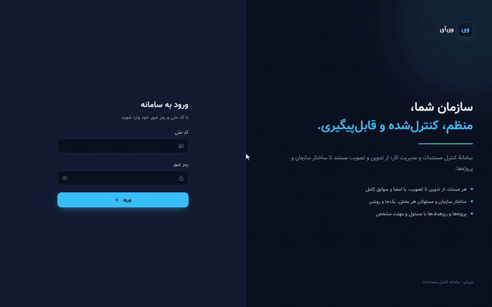</p>

### Write a document with a live print preview
Add a block, type — the paper on the left is the real PDF engine rendering your unsaved text.

<p align="center">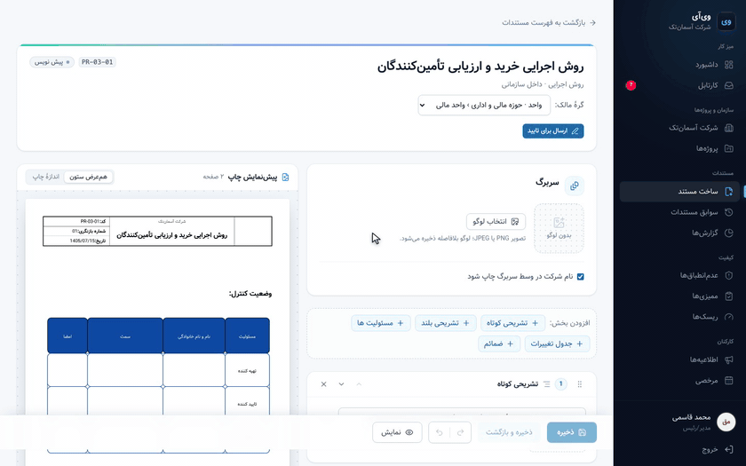</p>

### Approve with a signature
The managing director signs on the pad; the document becomes **تحت کنترل** and its official PDF is built in the background.

<p align="center">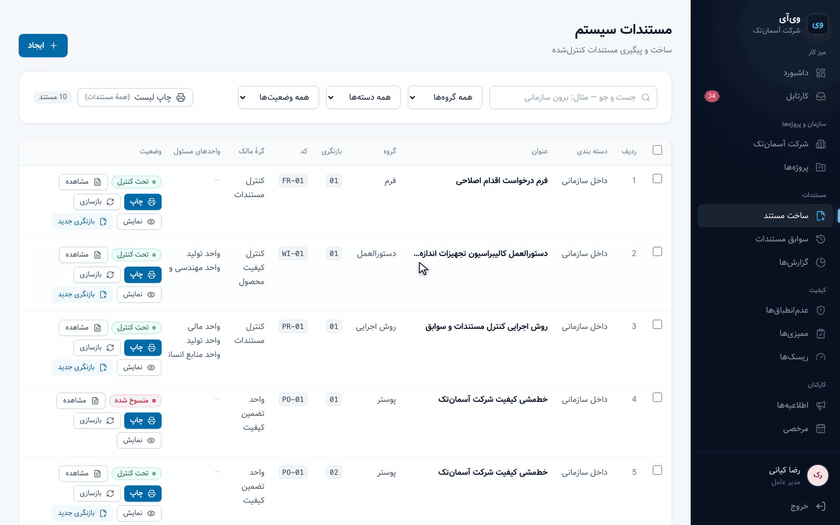</p>

<table>
<tr>
<td width="320" valign="top">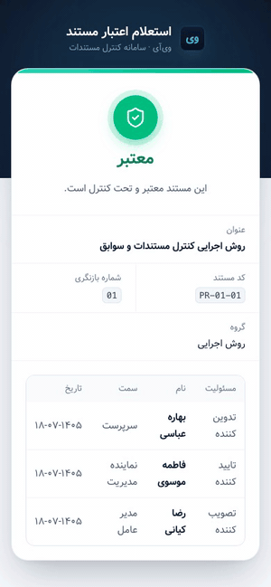</td>
<td valign="top">

### Scan the QR, know the truth
Every printed page carries a QR code that opens the public verification page — no account needed.
It answers from the live database: **معتبر** (valid, with who wrote, confirmed and approved it and when),
**منسوخ** (superseded — use the newer revision) or *not yet approved*. A photocopy of an old revision can
no longer pretend to be current.

</td>
</tr>
</table>

### A living org chart
Domains, units and sections with their leads. Document authority, project visibility and leave approvals all come from here.

<p align="center">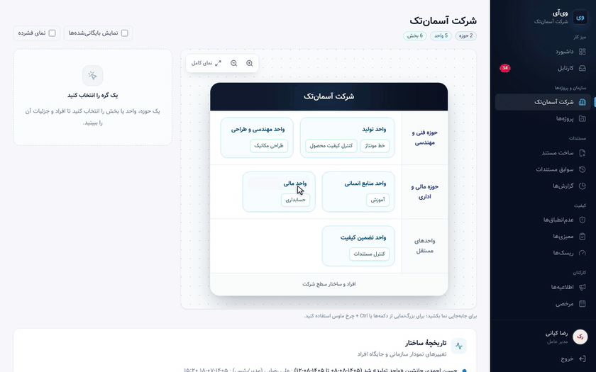</p>

### Projects with real progress
Weighted objectives, several assignees each, progress notes, meetings and a git-style activity feed.

<p align="center">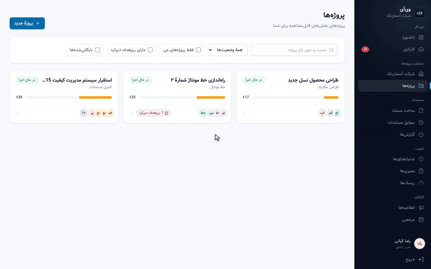</p>

### Quality: non-conformances, corrective actions and risks
From the report to the verified corrective action — then the 5×5 risk heat map (click a cell to filter).

<p align="center">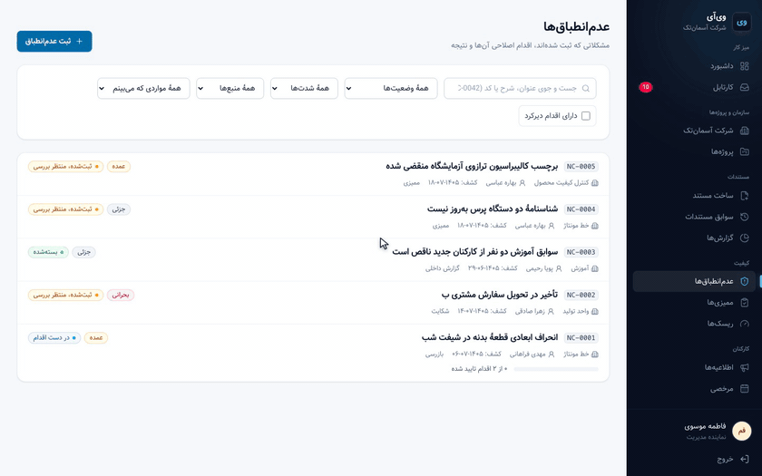</p>

### Reports and KPIs
Document cycle times, return rate, weighted company progress, workload per person and quality figures — computed live, exportable to CSV.

<p align="center">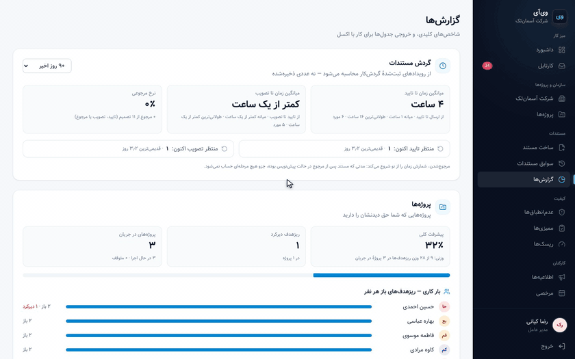</p>

<table>
<tr>
<td width="50%" valign="top">

### کارتابل — inbox & chat
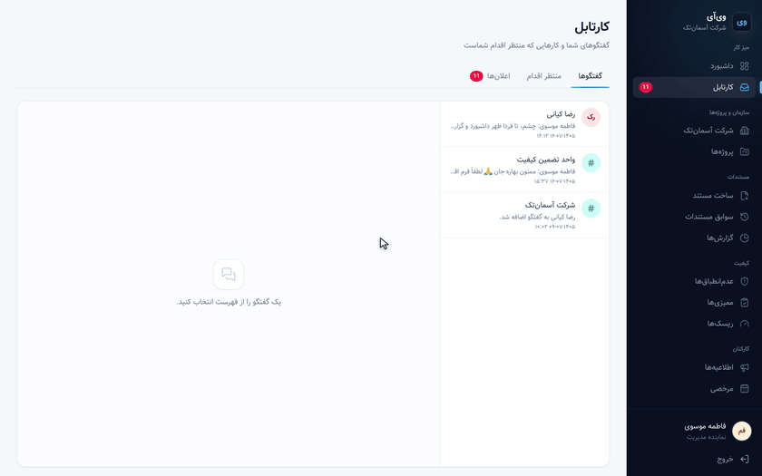

</td>
<td width="50%" valign="top">

### Leave & announcements
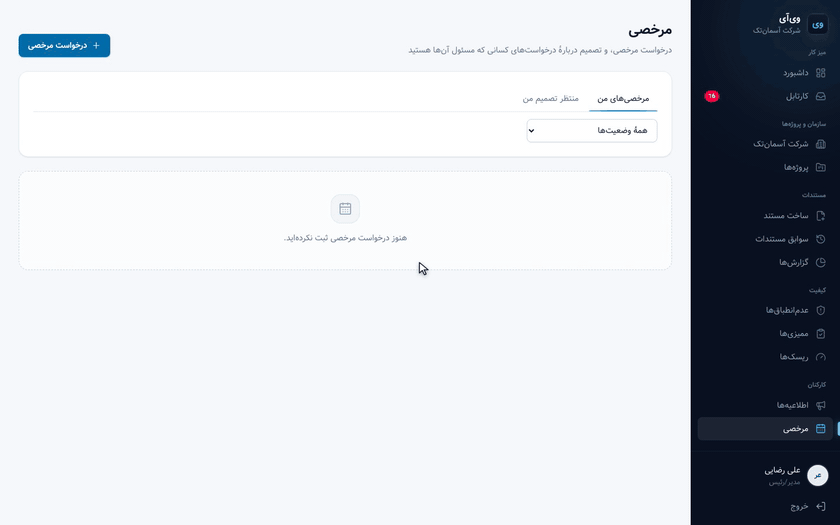

</td>
</tr>
</table>

---

## 🚀 Quick start

> VEye is proprietary ([License](#-license)): the steps below are for licensed installations and evaluations agreed with the author.

You need **Docker** with **Docker Compose**. Nothing else is installed on the host.

```bash
git clone https://github.com/Lvnc9/VEye.git
cd VEye
cp .env.example .env
```

Edit `.env`: set `POSTGRES_PASSWORD` and a random `DJANGO_SECRET_KEY`:

```bash
python3 -c "import secrets; print(secrets.token_urlsafe(50))"
```

Start everything (PostgreSQL, Redis, Django, Celery worker + beat, Next.js):

```bash
docker compose up -d --build
```

| Service | URL |
|---|---|
| Web app | http://localhost:3000 |
| API | http://localhost:8000/api/v1 |

Open http://localhost:3000 — the **first-run wizard** walks you through it:

1. create the technical *developer* account (it shapes the organisation and registers people, but can never sign),
2. name the company and build the chart: حوزه → واحد → بخش,
3. register personnel and place them (the مدیر عامل on the company node),
4. finish — everyone now signs in with their national code.

Migrations run automatically when the backend starts.

### Running the tests

```bash
docker compose exec -T backend python manage.py test --noinput
docker compose exec -T frontend npx tsc --noEmit
docker compose exec -T frontend npm run lint
docker compose exec -T frontend npx vitest run
```

About **1,700 backend** and **420 frontend** tests; the PDF engine is checked against golden files.

---

## 🌐 Deploying to a server

The repository ships a production stack, [`docker-compose.prod.yml`](docker-compose.prod.yml):
**gunicorn** for Django, a compiled Next.js app (`next start`), Celery worker + beat, PostgreSQL, Redis, and
**[Caddy](https://caddyserver.com)** in front with **automatic HTTPS**. Nothing is bind-mounted from the checkout and only
Caddy publishes ports (80/443).

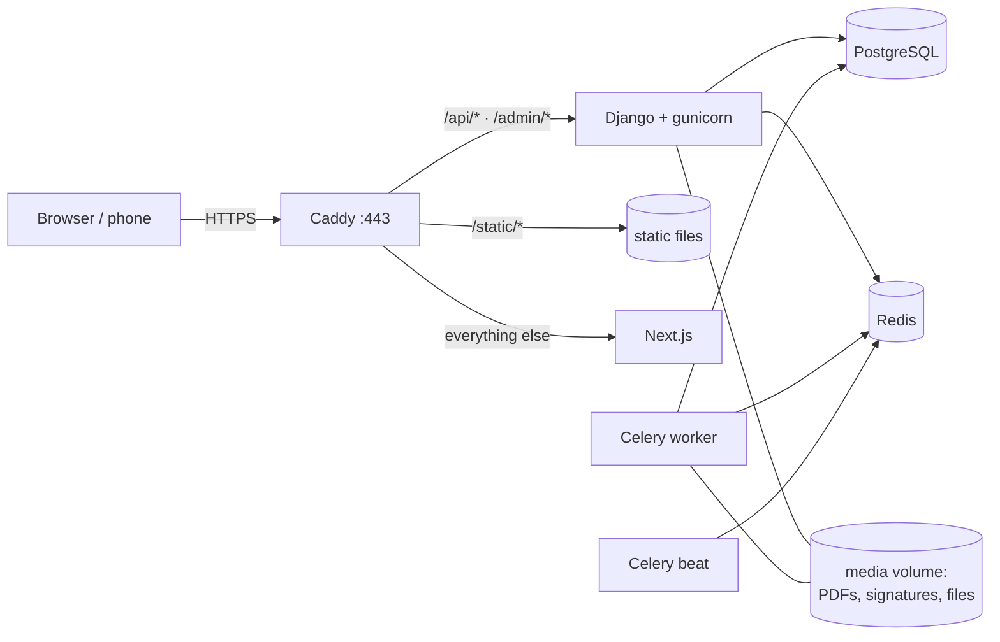

### 1. Prepare the server

- A Linux server with Docker Engine + the Compose plugin (2 vCPU / 4 GB RAM is a reasonable start; PDF builds are the heaviest work).
- A domain name, e.g. `veye.company.ir`, with an **A record** pointing at the server.
- Ports **80** and **443** open (Caddy needs 80 to obtain the certificate).

> Inside a closed network without public DNS? Replace `{$VEYE_DOMAIN}` in `deploy/Caddyfile` with your internal host
> name and add `tls internal` inside the block — Caddy then issues its own certificate.

### 2. Configure

```bash
git clone https://github.com/Lvnc9/VEye.git /opt/veye
cd /opt/veye
cp .env.example .env
```

Set these in `.env` (everything else can keep its default):

| Variable | Production value |
|---|---|
| `VEYE_DOMAIN` | `veye.company.ir` |
| `POSTGRES_DB` / `POSTGRES_USER` | e.g. `veye` / `veye` |
| `POSTGRES_PASSWORD` | a long random password |
| `POSTGRES_HOST` / `POSTGRES_PORT` | `postgres` / `5432` |
| `REDIS_URL` | `redis://redis:6379/0` |
| `DJANGO_SECRET_KEY` | 50+ random characters (also signs every login token) |
| `DJANGO_DEBUG` | `False` |
| `DJANGO_ALLOWED_HOSTS` | `veye.company.ir` |
| `CSRF_TRUSTED_ORIGINS` | `https://veye.company.ir` |
| `CORS_ALLOWED_ORIGINS` | `https://veye.company.ir` |
| `JWT_COOKIE_SECURE` | `True` |
| `FRONTEND_BASE_URL` | `https://veye.company.ir` — the address printed inside every QR code |
| `NEXT_PUBLIC_API_BASE_URL` | `https://veye.company.ir/api/v1` — compiled into the web app |
| `GUNICORN_WORKERS` | optional, default `3` (≈ 2 × CPU cores) |

`docker-compose.prod.yml` itself sets `DJANGO_SETTINGS_MODULE=config.settings.prod`, which turns on HTTPS redirects,
HSTS, secure cookies, and refuses to start with the development secret key.

### 3. Launch

```bash
docker compose -f docker-compose.prod.yml up -d --build
docker compose -f docker-compose.prod.yml ps
```

The first build takes a few minutes (it compiles the Next.js app). Then open `https://veye.company.ir` and complete the
first-run wizard as described in [Quick start](#-quick-start).

### 4. Back up

Everything lives in two places: the PostgreSQL database and the `media` volume (PDFs, signatures, uploaded files).

```bash
# database
docker compose -f docker-compose.prod.yml exec -T postgres pg_dump -U veye -Fc veye > veye-$(date +%F).dump
# files
docker run --rm -v veye_media:/m -v "$PWD":/b alpine tar czf /b/veye-media-$(date +%F).tgz -C /m .
```

Restore with `pg_restore -U veye -d veye --clean` and by extracting the archive back into the volume.
Keep copies off the server.

### 5. Update

```bash
cd /opt/veye
git pull
docker compose -f docker-compose.prod.yml up -d --build
```

Migrations run on start. Back up first.

### Production checklist

- [ ] `DJANGO_SECRET_KEY` and `POSTGRES_PASSWORD` are long, random and only in `.env` (never committed)
- [ ] `DJANGO_DEBUG=False`, `JWT_COOKIE_SECURE=True`, all URLs use `https://`
- [ ] `FRONTEND_BASE_URL` is the final public address — it is printed into the QR code of every PDF
- [ ] Nightly database + media backups, copied to another machine, and a restore you have actually tried
- [ ] Only ports 80/443 reachable from outside (PostgreSQL and Redis are not published by the production stack)

---

## 🏗 Architecture

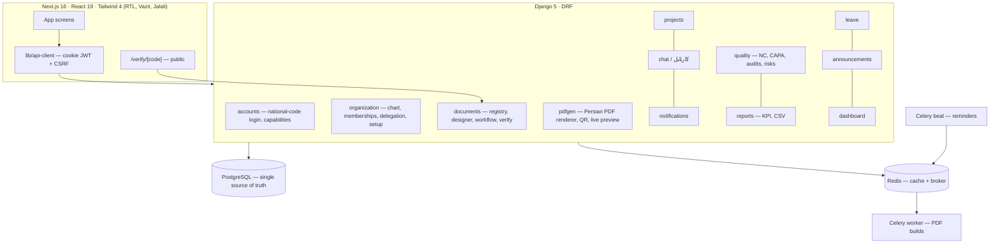

**Design rules the code follows**

- **PostgreSQL is the only source of truth.** Lists never render PDFs; official PDFs are built only on an explicit action, by Celery.
- **One writer per domain** (`services.py`): every state change and its audit event are written in the same transaction.
- **Authority comes from the org chart**, computed in one query (`access.py` / `authority.py`) — not from scattered flags.
- **Derived, never stored**: project progress, overdue flags, risk levels and KPIs are computed at read time, so they cannot go stale.
- **Persian first**: Persian error messages, Jalali dates, Arabic-to-Persian character normalisation, Persian digits.
- **No secrets in code**; all configuration comes from `.env`.

### Tech stack

| Layer | Technology |
|---|---|
| Backend | Python 3.12, Django 5, Django REST Framework, SimpleJWT (http-only cookies + CSRF), django-ratelimit |
| PDF | ReportLab, arabic-reshaper, python-bidi, qrcode, pypdfium2 (live preview) |
| Data | PostgreSQL 16, Redis 7 |
| Jobs | Celery worker + Celery beat |
| Frontend | Next.js 16 (App Router), React 19, TypeScript, Tailwind CSS 4, Tiptap, lucide icons, Vazir font |
| Tests | Django test runner (golden-file PDF tests), Vitest |
| Infrastructure | Docker Compose; Caddy in production |

### Project layout

```
backend/
  config/            settings (base / dev / prod), Celery, URLs
  apps/
    accounts/        users, national-code login, capabilities
    organization/    company, chart, memberships, delegation, first-run setup
    documents/       registry, designer content, workflow, public verify
    pdfgen/          the Persian PDF engine, builds, live preview, bulk print
    projects/        projects, objectives, meetings, activity feed
    chat/            کارتابل conversations and attachments
    notifications/   in-app notifications + scheduled reminders
    quality/         non-conformances, corrective actions, audits, risks
    reports/         KPIs and CSV exports
    leave/  announcements/  dashboard/  importer/ (V1 data import)
frontend/
  app/               routes: dashboard, documents, organization, projects, inbox,
                     quality, reports, leave, announcements, settings, verify, setup
  components/        UI primitives + feature components
  lib/               API client, Jalali dates, domain helpers
deploy/Caddyfile     reverse proxy for production
docker-compose.yml        development stack
docker-compose.prod.yml   production stack
```

---

## 🇮🇷 معرفی به فارسی

<div dir="rtl">

**وی‌آی** سامانهٔ تحت وب و فارسیِ کنترل مستندات و مدیریت سازمان است که روی سرور خود سازمان نصب می‌شود.

- **مستندسازی ISO:** روش اجرایی، دستورالعمل، پوستر و فرم را با طراح بلوکی یا طراح فرم بنویسید و همان لحظه برگهٔ چاپی را ببینید.
- **گردش کار و امضای دیجیتال:** تدوین ← تایید ← تصویب، بر اساس چارت سازمانی؛ فقط مدیر عامل تصویب می‌کند و همهٔ سوابق ثبت می‌شود.
- **PDF رسمی با کد QR:** هر کس برگه را با گوشی اسکن کند، همان لحظه می‌فهمد سند «معتبر» است یا «منسوخ».
- **چارت سازمانی زنده:** حوزه، واحد، بخش، مسئولان، اعضا و جانشین موقت.
- **پروژه‌ها:** ریزهدف‌های وزن‌دار، مسئول و مهلت، گزارش پیشرفت، جلسات و تاریخچهٔ فعالیت.
- **مدیریت کیفیت:** عدم‌انطباق، اقدام اصلاحی، ممیزی داخلی و ثبت ریسک با نقشهٔ حرارتی.
- **گزارش‌ها و KPI:** زمان تایید و تصویب، نرخ مرجوعی، پیشرفت وزنی شرکت و خروجی اکسل.
- **کارتابل، اعلان‌ها، مرخصی و اطلاعیه‌ها** برای کارهای روزمرهٔ کارکنان.
- **تمام فارسی، راست‌به‌چپ و با تاریخ شمسی**؛ همهٔ داده‌ها فقط روی سرور شما می‌ماند.

برای نصب، بخش [Quick start](#-quick-start) و برای راه‌اندازی روی سرور، بخش [Deploying to a server](#-deploying-to-a-server) را ببینید.

</div>

---

## 📜 License

**Copyright © 2025–2026 Sam. All rights reserved.** VEye is proprietary software; the source is published for viewing only.
Using, installing, hosting, copying or redistributing it needs written permission — see [`LICENSE`](LICENSE).
For a commercial licence or an installation for your organisation, get in touch via [github.com/Lvnc9](https://github.com/Lvnc9).

<div dir="rtl">

تمام حقوق این نرم‌افزار محفوظ است. برای خرید لایسنس یا نصب در سازمان خود از طریق [github.com/Lvnc9](https://github.com/Lvnc9) تماس بگیرید.

</div>

---

<div align="center">

**VEye** — سازمان شما، منظم، کنترل‌شده و قابل‌پیگیری.

<sub>The music in the teaser was synthesised for this project and is free of third-party rights. The GIFs show a fictional demo company.</sub>

</div>
